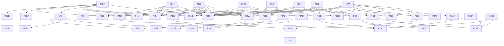

# A6 关键调用图

箭头均为processed MethodDef直接调用；原/处理token、RVA和每个IL offset见 methods.csv / business-callgraph.csv。可读业务图见event-map。以下仅展示主要业务边，其余直接调用留CSV。

```mermaid
flowchart TD
  P1ED --> P1EE
  P1F0 --> P7B7
  P1F0 --> P7BE
  P1F0 --> P7C2
  P356 --> P854
  P359 --> P087
  P35A --> P086
  P35B --> P089
  P35B --> P356
  P35B --> P358
  P35B --> P359
  P35B --> P45E
  P35B --> P460
  P35B --> P461
  P35D --> P089
  P35D --> P356
  P35D --> P358
  P35D --> P359
  P35D --> P452
  P35D --> P453
  P35D --> P454
  P35F --> P089
  P35F --> P1ED
  P35F --> P1EF
  P35F --> P1F0
  P35F --> P356
  P35F --> P358
  P35F --> P359
  P35F --> P35A
  P364 --> P089
  P364 --> P356
  P364 --> P358
  P364 --> P359
  P364 --> P3AB
  P364 --> P3AC
  P364 --> P3AD
  P367 --> P089
  P367 --> P368
  P368 --> P369
  P375 --> P356
  P375 --> P358
  P375 --> P359
  P375 --> P3BD
  P376 --> P356
  P376 --> P358
  P376 --> P359
  P376 --> P3C9
  P377 --> P356
  P377 --> P358
  P377 --> P359
  P377 --> P35A
  P377 --> P378
  P377 --> P379
  P377 --> P3AB
  P377 --> P3AD
  P377 --> P3AF
  P377 --> P3BD
  P377 --> P3C9
  P378 --> P854
  P3AB --> P7B7
  P3AB --> P7C2
  P3BF --> P7A1
  P3BF --> P7AF
  P3CB --> P7A1
  P3CB --> P7AF
  P452 --> P7A1
  P45E --> P7A1
  P461 --> P463
  P461 --> P7AF
  P854 --> P793
```

不要把相似用途视为同MethodDef。未绑定P36A未加入两个Envelope按钮的链。