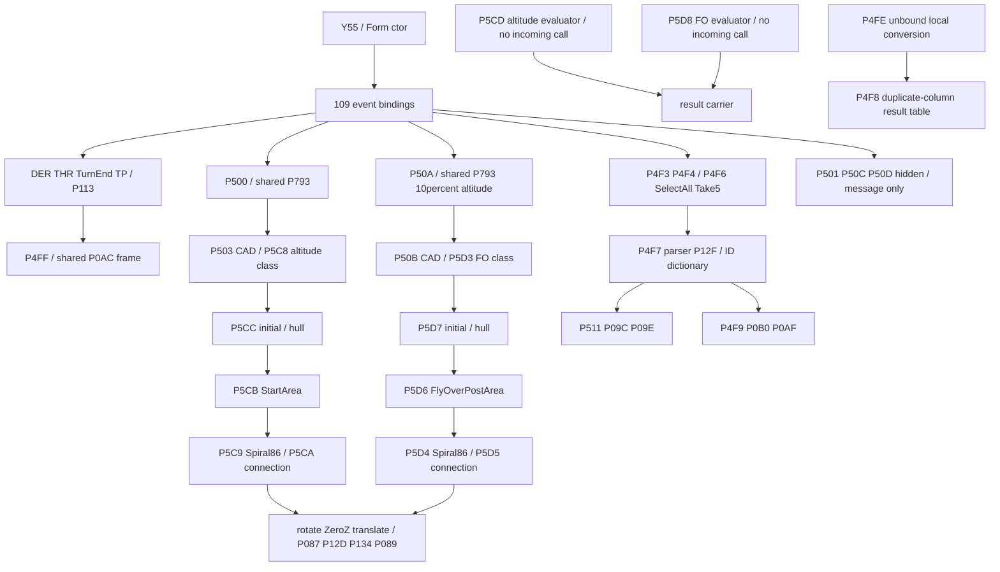

# 调用图与数据断点

```mermaid
flowchart TD
 CMD[Y55 / Form ctor] --> UI[109 event bindings]
 UI --> PICK[DER THR TurnEnd TP / P113]
 PICK --> FRAME[P4FF / shared P0AC frame]
 UI --> ALTREAD[P500 / shared P793]
 UI --> FREAD[P50A / shared P793 10percent altitude]
 ALTREAD --> A[P503 CAD / P5C8 altitude class]
 FREAD --> F[P50B CAD / P5D3 FO class]
 A --> AS[P5CC initial / hull]
 AS --> AP[P5CB StartArea]
 AP --> AO[P5C9 Spiral86 / P5CA connection]
 F --> FS[P5D7 initial / hull]
 FS --> FP[P5D6 FlyOverPostArea]
 FP --> FO[P5D4 Spiral86 / P5D5 connection]
 AO --> WRITE[rotate ZeroZ translate / P087 P12D P134 P089]
 FO --> WRITE
 UI --> SCREEN[P4F3 P4F4 / P4F6 SelectAll Take5]
 SCREEN --> DICT[P4F7 parser P12F / ID dictionary]
 DICT --> MARK[P511 P09C P09E]
 DICT --> HIGHLIGHT[P4F9 P0B0 P0AF]
 UI --> PLACE[P501 P50C P50D hidden / message only]
 EA[P5CD altitude evaluator / no incoming call] --> RESULT[result carrier]
 EF[P5D8 FO evaluator / no incoming call] --> RESULT
 CONV[P4FE unbound local conversion] --> BAD[P4F8 duplicate-column result table]
```

图没有连ScreenData到evaluator：已解码调用没有这条边，不能根据预期补。全精度edge在direct-calls.csv；泛型MethodSpec展开另见generic-calls.csv。每条handler原/处理身份、RVA、直接callee/API见event-map，不以窗口边界截断helper链。
